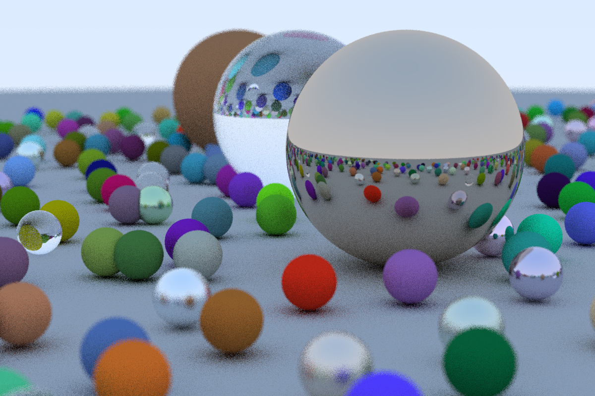

# First Ray Tracer

Ray tracing practice code from a great series by Peter Shirley. The code is written by C++.

## [Ray Tracing in One Weekend](https://github.com/RayTracing/InOneWeekend)
* Chapter 1: **Output an image** ([stb_image](https://github.com/nothings/stb/blob/master/stb_image.h))
* Chapter 2: **The vec3 class**
* Chapter 3: **Rays, a simple camera, and background**
* Chapter 4: **Adding a sphere**
* Chapter 5.1: **Surface normals**
* Chapter 5.2: **Multiple objects**
* Chapter 6: **Anti aliasing**
* Chapter 7: **Diffuse materials**
* Chapter 8: **Metal**
  * The source book lacks descriptions of changed in sphere.h and new random.h file
* Chapter 9: **Dielectrics**
* Chapter 10: **Positionable camera**
* Chapter 11: **Defocus blur**

## [Ray Tracing: The Next Week](https://github.com/RayTracing/TheNextWeek)

* Chapter 12: **Motion blur** 
  * Page 4 code block: `albedo->value`, at this time did not has texture class and this method
* Chapter 13: **Bounding Volume Hierarchies**
* Chapter 14: **Solid textures**
* Chapter 15: **Perlin noise**
  * At last calling noise_texture() function should with inputed scale parameter, but the article do not mention it.
* Chapter 16: **Image texture mapping**
  * Should set attunation with new rec.u and rec.v values in lambertian material scatter function
* Chapter 17.1: **Rectangles and lights**
  * Increase Camera `vfov` parameter to see all objects
* Chapter 17.2: **Cornel box: walls**
